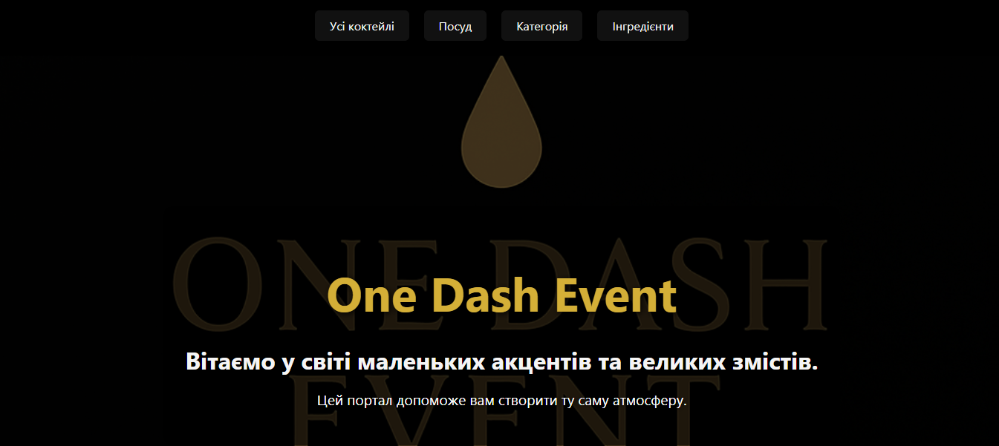
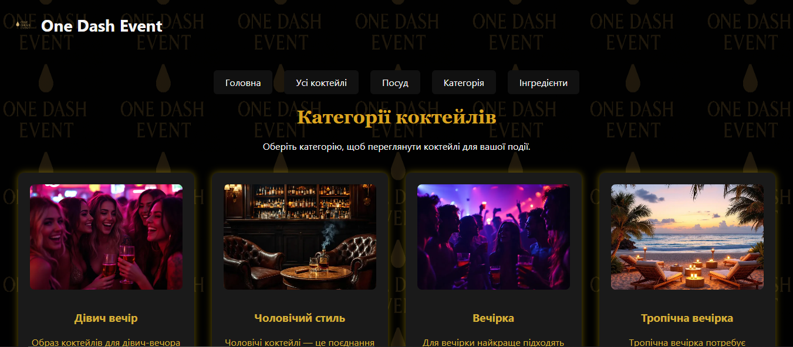
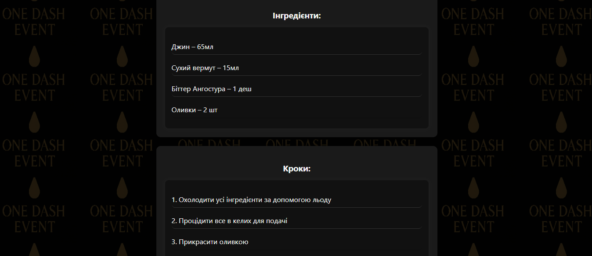
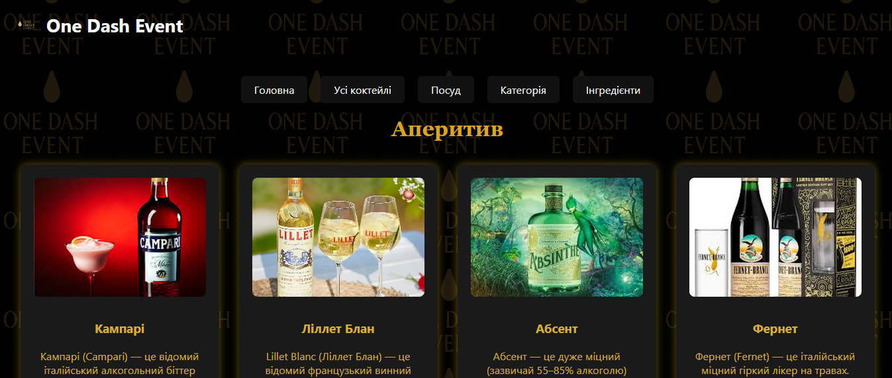
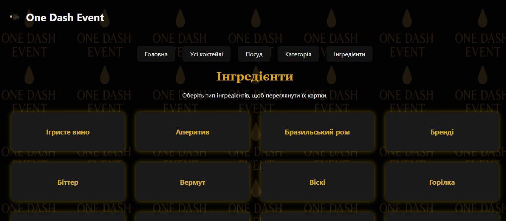
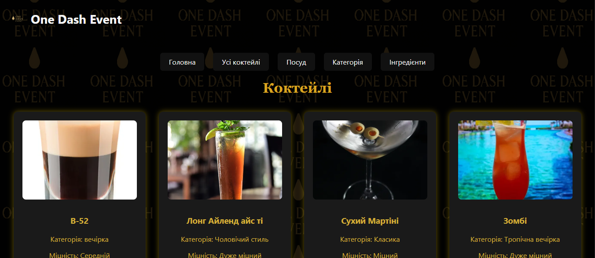
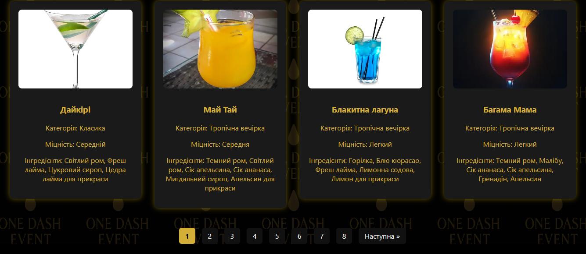
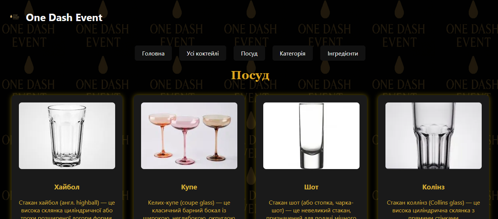
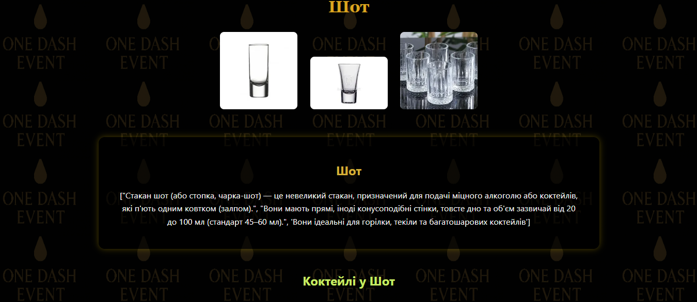

# One Dash Event (Flask App)

## Опис
Веб‑додаток на Flask для перегляду та пошуку коктейлів.  
Проєкт включає:
- Категорії коктейлів (вечірка, романтика, класика тощо).
- Пошук за назвою та інгредієнтами.
- Детальні сторінки коктейлів з фото, інгредієнтами та кроками приготування.
- Навігацію через меню та контекстну кнопку «назад».

Цей сайт створений як частина портфоліо Herman.

---

## Використані технології
- Python (Flask, Jinja2, Werkzeug)
- HTML, CSS
- JSON (база даних коктейлів)

---

##  Скриншоти

### Головна сторінка


### Категорія коктейлів


### Детальна сторінка коктейлю


### Детальна сторінка коктейлю2


### Деталі інгредієнта


### Меню інгредієнтів


### Усі коктейлі


### Пагінація


### Посуд


### Деталі посуду


## Запуск проєкту

1. Клонувати репозиторій:
   ```bash
   git clone <repo-url>
   cd project-folder